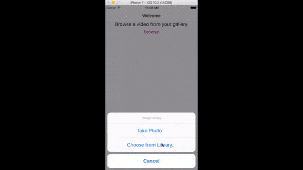

A video player built with react-native

What this looks like
=====

Run it
=====

This assumes you have already installed [node.js](https://nodejs.org/en/) and [react-native](https://facebook.github.io/react-native/docs/getting-started.html)

- npm install
- react-native link
- react-native run-ios

In order to try it in the ios simulator, drag a video to the simulator to be able to access it in the simulator gallery.